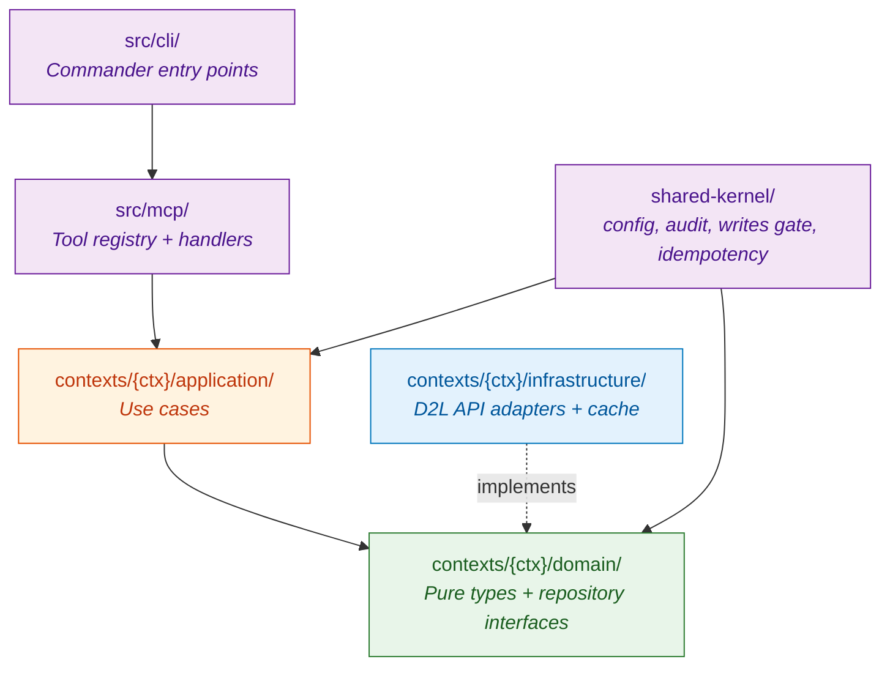

# Architecture overview

`brightspace-mcp` follows Domain-Driven Design with bounded contexts. Layering is enforced at build time by `dependency-cruiser`.

## Layering

**Rules** (enforced by `npm run check:deps`):
- `domain` cannot import `application`, `infrastructure`, or any context other than itself.
- `application` cannot import `infrastructure` (only domain interfaces).
- Cross-context imports go through domain types only — no `import x from '@/contexts/foo/infrastructure/...'`.

## Bounded contexts

| Context | Aggregate roots | Responsibilities |
|---|---|---|
| `authentication` | `Session`, `UserIdentity` | Multi-strategy auth, MFA solving, session caching |
| `courses` | `Course` | Enrolment list, course metadata |
| `assignments` | `Assignment`, `Submission`, `Feedback` | Dropbox folders, submissions, grades feedback |
| `grades` | `Grade` | Final grades per course |
| `content` | `Module`, `Topic` | Course content tree, file extraction |
| `communications` | `Announcement`, `Discussion` | News feed, forum threads |
| `calendar` | `CalendarEvent` | Course calendar |

## Composition root

`src/composition-root.ts` wires everything:

1. Load config from `~/.brightspace-mcp/config.yaml` (or `--config`/`BRIGHTSPACE_CONFIG`).
2. Resolve credentials from `env:` / `keychain:` / `file:` references.
3. Build the `D2lHttpClient` with the right auth strategy (or chain).
4. Instantiate one repository per context (D2L impl + cache decorator).
5. Create the `WritesGate` from config + CLI flag.
6. Pass everything as `ToolDeps` to `registerAllTools(server, deps)`.

## Adding a new MCP tool

Recipe (the `submit_assignment` writes-gated example is good to copy):

1. **Domain** — add the type/method to `src/contexts/<ctx>/domain/<X>Repository.ts` if needed.
2. **Application** — add a use case `src/contexts/<ctx>/application/<verb><Noun>.ts`. Keep it small: input → repository call → output.
3. **Infrastructure** — implement the new repository method in `src/contexts/<ctx>/infrastructure/D2l<X>Repository.ts`.
4. **Schema** — add the Zod input schema to `src/mcp/schemas.ts`.
5. **Tool handler** — add `src/mcp/tools/<verb>-<noun>.tool.ts` exporting `handle<X>` and a `<X>Deps` interface.
6. **Registry** — `src/mcp/registry.ts` → register inside `registerAllTools`. If it's a write, gate behind `deps.writesGate.allowsWrites`.
7. **Tests** — mirror the file in `tests/` with both unit and integration coverage.

Run `npm run check` before pushing. Coverage threshold is 85% statements.

## Cross-cutting components

| Component | Where |
|---|---|
| Config loading + schema validation | `src/shared-kernel/config/` |
| Credential refs (`env:`, `keychain:`, `file:`) | `src/shared-kernel/credentials/` |
| Audit logger (NDJSON to disk) | `src/shared-kernel/audit/` |
| Idempotency store | `src/shared-kernel/idempotency/` |
| Writes gate | `src/shared-kernel/writes/WritesGate.ts` |
| ZIP/DOCX/XLSX text extraction | `src/shared-kernel/zip/extractZipEntry.ts` |
| Path expansion (`~/`, `%VAR%`, absolute) | `src/mcp/tools/get-topic-file.tool.ts` (helper) |

## CLI commands

`src/cli/commands/`:

- `serve` — start the MCP stdio server
- `setup` — interactive YAML wizard
- `auth` — manual re-auth, useful when sessions expire
- `config show / validate / set` — inspect / edit YAML
- `cache clear / status` — cache management

## Test architecture

- **Unit tests** mirror `src/` in `tests/`.
- **Integration tests** live in `tests/integration/` and use real Vitest + `nock` HTTP mocking.
- **End-to-end** in `tests/e2e/` boot a real Node subprocess and speak MCP over stdio.

`vitest.config.ts` enforces 85% statement coverage.

## Release flow

1. `npm version patch|minor|major` (or edit `package.json` + `CHANGELOG.md` manually).
2. Push tag — CI runs `check` + `build:clean`.
3. CI publishes to npm and builds the Docker image.

CI files:
- `.github/workflows/ci.yml` — lint + test + depcruise + coverage
- `.github/workflows/release.yml` — npm publish on tag
- `.github/workflows/docker.yml` — image build & push
