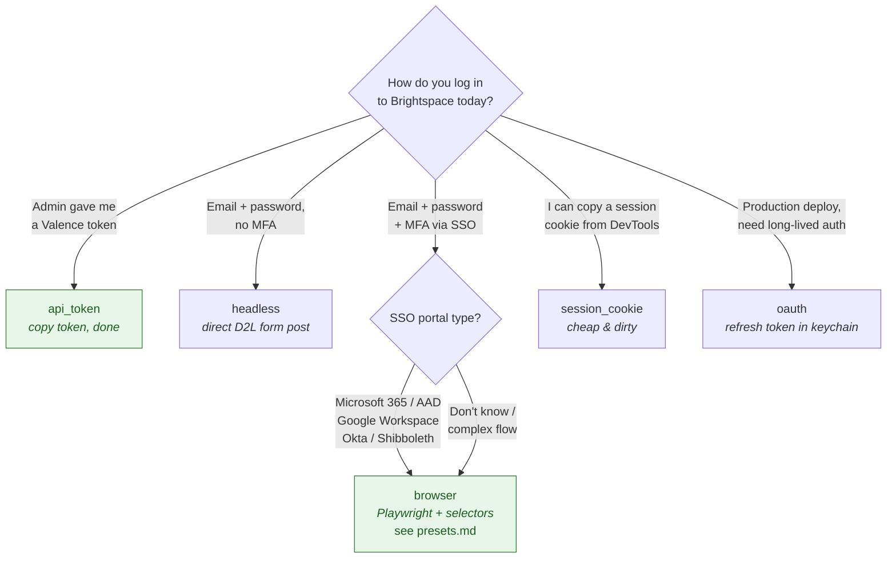

# Authentication strategies

Five strategies are supported. Pick the one that matches your school's login flow.

## Decision matrix

| Strategy | Setup effort | MFA support | Server-side state | When to use |
|---|---|---|---|---|
| `api_token` | Lowest — paste a token | N/A | Stateless | Your admin gives you a Valence API token |
| `oauth` | Medium — register an OAuth client | Built-in | Refresh token cached | Production, long-lived deployments |
| `session_cookie` | Lowest — copy from browser | N/A (already auth'd) | Cookie cached | Quick testing, ad-hoc usage |
| `browser` | Highest — selectors + Playwright | TOTP / Duo / manual | Session cookies cached | Most schools (handles SSO) |
| `headless` | Medium — selectors only | TOTP / Duo / manual | Session cookies cached | Direct D2L login (no SSO redirect) |

You can also chain fallbacks (`auth.fallbacks: [api_token, browser]`).

## Decision tree



---

## `api_token`

Simplest strategy. Requires a Valence API token from your admin.

```yaml
profiles:
  my_school:
    base_url: https://learn.school.edu
    auth:
      strategy: api_token
      api_token:
        token_ref: env:BRIGHTSPACE_API_TOKEN
```

Token references support:
- `env:VAR` — read from environment
- `keychain:service/account` — macOS/Linux keyring (via `@napi-rs/keyring`)
- `file:/path` — read raw file contents

## `oauth`

Production-grade. You register an OAuth client with your Brightspace admin and the server handles token refresh automatically.

```yaml
profiles:
  my_school:
    base_url: https://learn.school.edu
    auth:
      strategy: oauth
      oauth:
        authorize_url: https://auth.brightspace.com/core/connect/authorize
        token_url: https://auth.brightspace.com/core/connect/token
        client_id: your-client-id
        client_secret_ref: env:BRIGHTSPACE_OAUTH_SECRET
        redirect_uri: http://localhost:3000/callback
        scopes: [core:*:*]
        refresh_token_ref: keychain:brightspace-mcp/oauth-refresh
```

First run launches a browser for consent, stores the refresh token in the keychain, then renews access tokens automatically.

## `session_cookie`

Quick, and the only path for tenants whose MFA cannot be scripted (Microsoft Authenticator number-matching, FIDO2/Yubikey, biometrics, etc.).

```yaml
profiles:
  my_school:
    base_url: https://learn.school.edu
    auth:
      strategy: session_cookie
      session_cookie:
        cookie_ref: keychain:brightspace-mcp/default-cookie
        session_ttl_seconds: 3600
```

### Capturing the cookie

**Recommended — use the recorder:**

```bash
brightspace-mcp record-auth --save-to keychain
```

Opens a browser, you authenticate manually, the recorder captures cookies and writes the YAML. See [setup-guide.md §3 option B](./setup-guide.md#b-recorder-you-log-in-manually-we-steal-the-cookie).

**Manual extraction** (alternative): open DevTools on a logged-in Brightspace tab, copy the `d2lSessionVal` cookie value, and use `cookie_ref: env:BRIGHTSPACE_COOKIE` with that value in your environment.

The cookie typically expires after ~1 hour — re-run `record-auth` when auth tools start failing with 401/403.

## `browser`

Full automation via Playwright. Logs in like a human (including SSO redirects and MFA).

```yaml
profiles:
  my_school:
    base_url: https://learn.school.edu
    auth:
      strategy: browser
      browser:
        login_url: https://learn.school.edu/d2l/login
        headless: true
        session_ttl_seconds: 3600
        username_ref: env:BRIGHTSPACE_USERNAME
        password_ref: env:BRIGHTSPACE_PASSWORD
        selectors:
          username: "#email"
          password: "#password"
          submit: "#login-btn"
          # Multi-step login (Microsoft AAD style):
          password_submit: "#login-btn"
          # Optional best-effort clicks before MFA input appears:
          pre_mfa_clicks: []
          mfa_input: "#code"
          mfa_submit: "#verify-btn"
          # Optional best-effort clicks after MFA submit (e.g. "Stay signed in?" dialog):
          post_mfa_clicks: []
          post_login: "d2l-navigation"
        mfa:
          strategy: totp
          totp:
            secret_ref: env:BRIGHTSPACE_TOTP_SECRET
```

**Selector flow:**
1. Navigate to `login_url`
2. Fill `username`, click `submit`
3. Wait for `password`, fill it, click `password_submit` (if defined; else `submit` is reused)
4. Run `pre_mfa_clicks` best-effort (skip any not found)
5. Wait for `mfa_input` (5s) — if not present, skip MFA
6. Solve MFA via the configured strategy, fill code, click `mfa_submit`
7. Run `post_mfa_clicks` best-effort
8. Wait for `post_login` (30s) — confirms successful login
9. Extract session cookies, cache them

**Requires** Playwright: `npm install playwright && npx playwright install chromium`. Listed as `optionalDependency`.

→ For Microsoft AAD selectors, see [presets.md](./presets.md).

## `headless`

Lighter than `browser`. Uses raw HTTP (cookies + form posts) instead of Playwright. Good for direct D2L login without SSO redirects.

```yaml
profiles:
  my_school:
    base_url: https://learn.school.edu
    auth:
      strategy: headless
      headless:
        login_url: https://learn.school.edu/d2l/lp/auth/login/login.d2l
        username_ref: env:BRIGHTSPACE_USERNAME
        password_ref: env:BRIGHTSPACE_PASSWORD
        session_ttl_seconds: 3600
        mfa: { strategy: none }
```

⚠️ Only works when the login form is server-rendered (no React/Angular). Most modern SSO portals require `browser`.

---

## `record-auth` — when scripted strategies can't work

Some authentication flows are fundamentally impossible to automate: Yubikey USB taps, fingerprint readers, Microsoft Authenticator number-match (you must approve a number shown on screen), and FIDO2/passkeys. For all of these, use the recorder:

```bash
brightspace-mcp record-auth --save-to keychain
# or: --save-to file | env | print
```

The recorder opens a **real visible browser** (not headless). You log in however your tenant requires — approve the push notification, tap the Yubikey, whatever — and once you reach `/d2l/home` the recorder captures `d2lSessionVal` and `d2lSecureSessionVal` and writes the config automatically under the `session_cookie` strategy.

| `--save-to` value | Where cookies are stored |
|---|---|
| `keychain` *(recommended)* | OS keychain (macOS Keychain / GNOME Keyring / Windows Credential Manager) |
| `file` | Encrypted credential file (`~/.brightspace-mcp/credentials.enc`) |
| `env` | Prints `export BRIGHTSPACE_COOKIE="..."` — pipe into your shell rc |
| `print` | Prints the raw cookie string — copy/paste as needed |

**Limitations:**
- D2L session cookies expire in ~1 hour. Re-run `record-auth` when auth tools start returning 401.
- Cookies are tied to the IP/browser that created them on some tenants — VPN changes may invalidate them early.
- There is no automated re-auth path for `session_cookie` — the MCP server cannot pop a browser without user interaction.

**When to use `record-auth` vs. `browser` strategy:**

| Situation | Recommended approach |
|---|---|
| TOTP authenticator app (scriptable) | `browser` strategy with `mfa.strategy: totp` |
| Duo Push notifications | `browser` strategy with `mfa.strategy: duo_push` |
| Microsoft Authenticator number-match | `record-auth` |
| FIDO2 / Yubikey / biometric | `record-auth` |
| Any MFA that requires physical interaction | `record-auth` |

---

## MFA strategies

Configured under `auth.<strategy>.mfa`:

| Strategy | When to use |
|---|---|
| `none` | No MFA |
| `totp` | TOTP authenticator (Authy, Google Authenticator, 1Password) |
| `duo_push` | Duo push notifications |
| `manual_prompt` | Server prompts you to type the code on stdin (interactive only) |

### TOTP example

```yaml
mfa:
  strategy: totp
  totp:
    secret_ref: env:BRIGHTSPACE_TOTP_SECRET
    digits: 6           # default
    period: 30          # default
    algorithm: SHA1     # default
```

Since v0.15, the TOTP implementation accepts secrets of any base32 length (RFC 6238 compliant). The 80-bit (16 char) secrets issued by some services work fine.

### Duo Push example

```yaml
mfa:
  strategy: duo_push
  duo_push:
    poll_interval_ms: 1000
    timeout_ms: 120000
```

Server sends a push and polls until the user approves on their phone.
