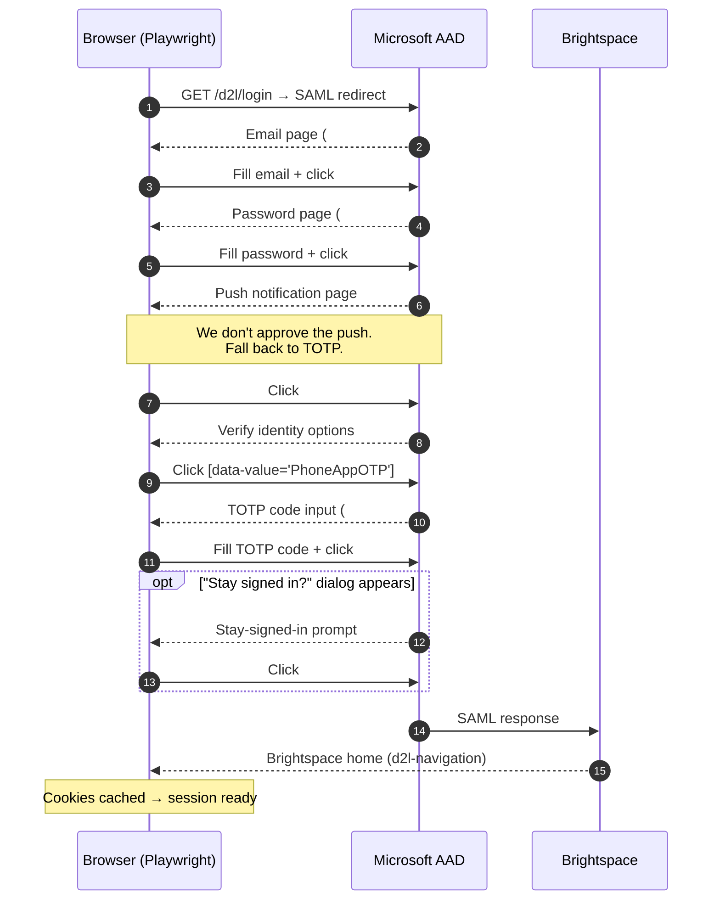

# Configuration presets

Known-good configurations for common Brightspace setups. Use these as starting points — replace `https://learn.school.edu` with your base URL and `env:VAR` references with your own.

## Microsoft Azure AD with Authenticator app

Used by many universities that federate Brightspace login through Microsoft 365 / Office 365.

**Login flow recognised:**



The selectors map to the YAML below as: `pre_mfa_clicks` for steps 6–8, `mfa_input`/`mfa_submit` for steps 9–10, and `post_mfa_clicks` for the optional "Stay signed in?" dialog.

```yaml
profiles:
  my_school:
    base_url: https://learn.school.edu
    auth:
      strategy: browser
      browser:
        login_url: https://learn.school.edu/d2l/login
        headless: true
        session_ttl_seconds: 3600
        username_ref: env:BRIGHTSPACE_USERNAME
        password_ref: env:BRIGHTSPACE_PASSWORD
        selectors:
          # Microsoft Azure AD email + password (multi-step)
          username: "#i0116"
          password: "#i0118"
          submit: "#idSIButton9"
          password_submit: "#idSIButton9"
          # Push notification → fall back to TOTP code entry
          pre_mfa_clicks:
            - "#signInAnotherWay"
            - "[data-value='PhoneAppOTP']"
          mfa_input: "#idTxtBx_SAOTCC_OTC"
          mfa_submit: "#idSubmit_SAOTCC_Continue"
          # "Stay signed in?" dialog after MFA
          post_mfa_clicks:
            - "#idSIButton9"
          # Confirms successful redirect to Brightspace
          post_login: "d2l-navigation"
        mfa:
          strategy: totp
          totp:
            secret_ref: env:BRIGHTSPACE_TOTP_SECRET
    session:
      cache_backend: memory
      preemptive_refresh_seconds: 300

writes:
  enabled: false
  dry_run: false
```

**Note on the `post_login` selector:** Some Brightspace tenants render `d2l-navigation`, others `d2l-labs-navigation`. If auth times out at this step but you reach the Brightspace home in the browser, swap the selector.

**Edge case — push directly accepted:** If your Authenticator profile has push notifications enabled and you happen to approve them on your phone, the `pre_mfa_clicks` are skipped (best-effort), `mfa_input` is not found, and the auth proceeds to `post_login` directly. This works.

## Standard D2L direct login (no SSO)

For Brightspace tenants that authenticate directly against D2L without an SSO redirect.

```yaml
profiles:
  my_school:
    base_url: https://learn.school.edu
    auth:
      strategy: headless
      headless:
        login_url: https://learn.school.edu/d2l/lp/auth/login/login.d2l
        username_ref: env:BRIGHTSPACE_USERNAME
        password_ref: env:BRIGHTSPACE_PASSWORD
        session_ttl_seconds: 3600
        mfa:
          strategy: none
```

## API token (for admins or automation)

When your admin has issued a Valence API token:

```yaml
profiles:
  my_school:
    base_url: https://learn.school.edu
    auth:
      strategy: api_token
      api_token:
        token_ref: env:BRIGHTSPACE_API_TOKEN
```

## Session cookie (quick & dirty)

When you can extract `d2lSessionVal` from your browser DevTools:

```yaml
profiles:
  my_school:
    base_url: https://learn.school.edu
    auth:
      strategy: session_cookie
      session_cookie:
        cookie_ref: env:BRIGHTSPACE_COOKIE
        session_ttl_seconds: 3600
```

## Hybrid with fallback chain

Try API token first; if it fails (e.g. token expired), fall back to browser login:

```yaml
profiles:
  my_school:
    base_url: https://learn.school.edu
    auth:
      strategy: api_token
      fallbacks: [browser]
      api_token:
        token_ref: env:BRIGHTSPACE_API_TOKEN
      browser:
        # … full browser config here …
```

---

## Contributing your preset

If you got `brightspace-mcp` working with a tenant that needed unusual selectors, please open a PR adding it here (anonymised — do not commit your real `base_url` or credentials). Common ones we'd love to see:

- Google Workspace SAML
- Okta SSO
- ADFS / on-prem AD
- Shibboleth federations
