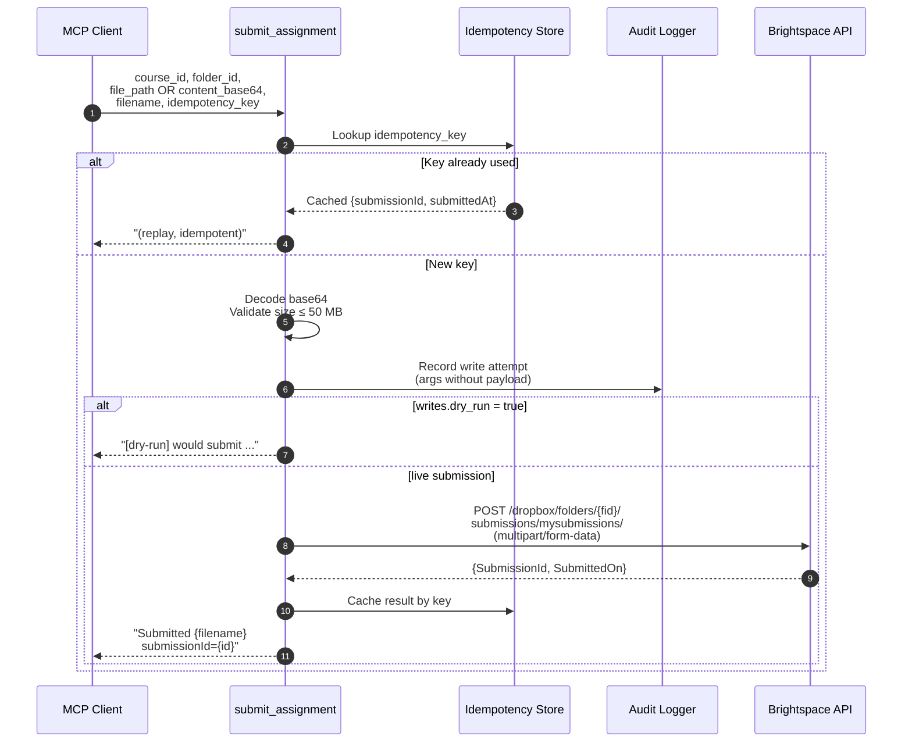

# Write operations

By default, `brightspace-mcp` is **read-only**. Write operations (submit assignments, post discussion replies, mark announcements as read) are disabled.

To enable writes you must satisfy **two independent gates**:

1. **Config flag** — `writes.enabled: true` in `~/.brightspace-mcp/config.yaml`
2. **CLI flag** — `--enable-writes` passed to `serve`

If either is missing, the write tools are not registered with the MCP server. This double-gate is intentional: a leaked config file alone cannot enable writes; a forgotten CLI flag alone cannot either.

## Enabling writes

### 1. Edit your config

```yaml
writes:
  enabled: true
  dry_run: false   # set to true to log writes without sending them
```

### 2. Update your client launch args

For Claude Desktop / Cursor / Windsurf, add `--enable-writes` to the args:

```json
{
  "mcpServers": {
    "brightspace": {
      "command": "npx",
      "args": ["--yes", "brightspace-mcp", "serve", "--enable-writes"]
    }
  }
}
```

For Claude Code (`~/.claude.json`):

```json
{
  "mcpServers": {
    "brightspace-mcp": {
      "type": "stdio",
      "command": "node",
      "args": ["/path/to/build/cli/main.js", "serve", "--enable-writes"],
      "env": { ... }
    }
  }
}
```

Restart / reload-plugins after editing.

## UI fallback for restricted tenants

Some Brightspace tenants disable the Valence student-side dropbox-submission API but still let students submit through the web UI. When the API call returns 403/404, `submit_assignment` automatically retries via Playwright, scripting the actual web form. No extra setup needed for stock English Brightspace.

### Customizing selectors per tenant

If your tenant has a customized UI (or you want to skip the locale forcing and run in your native language), override the selectors via YAML:

```yaml
profiles:
  my_school:
    base_url: https://learn.school.edu
    auth: { ... }
    ui_submit:
      # Per-step Playwright locators. Each one is optional — defaults are
      # English-first with translations for ES/PT/FR as fallbacks.
      selectors:
        add_file_button: 'button[data-d2l-id="add-file"]'
        my_computer_link: 'a[title="Local files"]'
        upload_button: 'button:has-text("Upload now")'
        commit_button: 'button:has-text("Attach")'
        submit_button: 'button:has-text("Send")'
        # Optional — only set if your tenant shows a confirm-submission modal
        confirm_button: 'button:has-text("Yes, send it")'
      # Force-render Brightspace in this locale. Default: en-US.
      # Set to null to inherit the user's profile language (and supply your own
      # localized selectors above).
      force_locale: en-US
```

The defaults use `:has-text(...)` pseudo-selectors with translations comma-separated, so even tenants that override `Accept-Language` typically work without overrides.

## Available write tools

| Tool | What it does | Idempotency |
|---|---|---|
| `submit_assignment` | Upload a file to a Brightspace Dropbox folder | Caller-supplied `idempotency_key` |
| `post_discussion_reply` | Reply to a forum thread | Caller-supplied `idempotency_key` |
| `mark_announcement_read` | Mark an announcement read | Idempotent at API level |

## Request flow



## Safety features

**Audit log.** Every write attempt is recorded to `~/.brightspace-mcp/audit.log` (NDJSON, mode 0600) before the call is sent. Includes correlation ID, tool name, args (with secrets redacted), timestamp. Query it via the `get_audit_log` MCP tool — read-only, no writes-gate required.

**Idempotency cache.** Writes accepting an `idempotency_key` are deduplicated. A replay returns the cached response without re-sending. Cached entries persist in `~/.brightspace-mcp/idempotency.json`.

**Dry-run mode.** Set `writes.dry_run: true` to log what *would* be sent without actually sending. The tool returns a `[dry-run]` confirmation. Use this to verify your client integration before going live.

**Size limit.** `submit_assignment` caps file uploads at 50 MB. Larger files are rejected before encoding.

**Resubmit guard.** `submit_assignment` looks up the assignment's `SubmissionType` before submitting. If the assignment is set to *replace previous* (D2L type 0) or *only one allowed* (type 2) AND a submission already exists, the tool refuses with a clear error including the existing submission timestamp. Pass `replace: true` to confirm and proceed. Append-mode assignments (type 1) submit without checks.

## `submit_assignment` example

You can pass the file two ways. **`file_path` is preferred** for anything >1 MB — the server reads from disk locally, avoiding the ~33% token cost of base64-encoding through the LLM.

```jsonc
// Tool args — file_path (recommended)
{
  "course_id": "424258",
  "folder_id": "405350",
  "file_path": "~/Downloads/Lab4-final.zip",   // ~/, %VAR%, or absolute
  "mime_type": "application/zip",
  "idempotency_key": "idem-2026-05-09-attempt-1"
}
```

```jsonc
// Tool args — content_base64 (when the file isn't on disk)
{
  "course_id": "424258",
  "folder_id": "405350",
  "filename": "Lab4-final.zip",
  "content_base64": "UEsDBBQA...",
  "mime_type": "application/zip",
  "idempotency_key": "idem-2026-05-09-attempt-1"
}
```

`filename` is optional with `file_path` (defaults to the basename) and required with `content_base64`.

Returns:

```
Submitted Lab4-final.zip — submissionId 12345 at 2026-05-09T22:15:33.000Z (cid=sub-1715299...)
```

Replays of the same `idempotency_key` return the cached `submissionId` without re-uploading.

## `post_discussion_reply` example

```jsonc
{
  "course_id": "424258",
  "topic_id": "112233",
  "parent_post_id": "445566",        // null for a top-level reply
  "html": "<p>Great point — see RFC 4271 §6.</p>",
  "idempotency_key": "idem-discussion-2026-05-09"
}
```

## When to think twice before enabling writes

- **Shared / multi-tenant environment** — anyone with stdin access to the server can issue writes.
- **CI / automated pipelines** — prefer dry-run + manual review.
- **Personal Brightspace account where you'll be graded** — make sure the `idempotency_key` strategy avoids accidental double-submissions.

For most personal use cases (a student submitting their own homework via Claude), enabling writes is fine. Just keep the audit log around as a paper trail.
